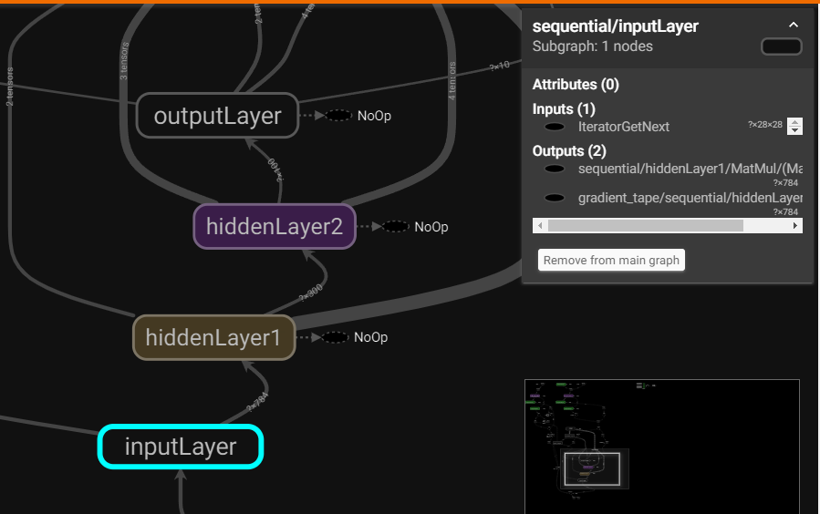

# ANN_implementation
ANN implementation is done on hello world of computer vision 
i.e., mnist data set

Total 4 layers were used including input and output layer

Dataset is flatten then feed to ANN

Sequential ANN is used.
input layer have 784 units (28pixel *28pixel = 784)


parameters used are:
  loss_function: sparse_categorical_crossentropy
  metrics: accuracy
  optimizer: SGD (Stochastic Gradient Descent)


then dense neural network with 300 neuron & 100 neuron as hidden layer is used

 with the activation function as ReLU

and the activation function used for output layer is softmax


## To update environment from environment.yml use
```buildoutcfg
conda env update --prefix ./env --file environment.yml  --prune
```
## To visilized tensorboard 
```buildoutcfg
tensorboard --logdir=logs_dir/tensorboard_logs
```